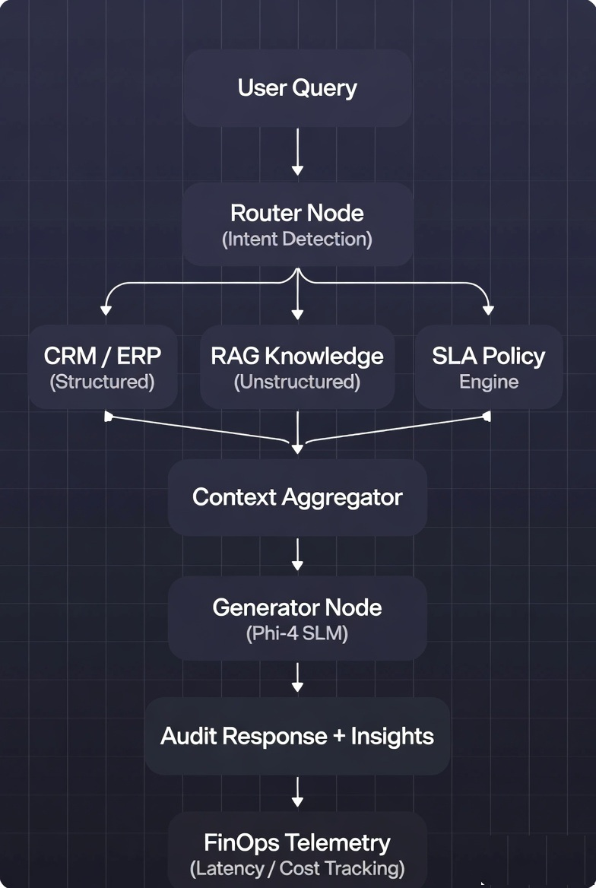

# Telecom-Mesh: Zero-Trust Enterprise AI Controller

[](https://www.python.org/)
[](https://ollama.ai/)
[](https://www.langchain.com/langgraph)
[](https://opensource.org/licenses/MIT)

**Telecom-Mesh** is a high-seniority architectural prototype designed for complex global Telecommunications and IT environments. It demonstrates the integration of **Generative AI**, **Agentic Workflows**, and **RAG frameworks** into legacy enterprise stacks (ERP/CRM/SCM).

---

##  The Problem: Telecom SLA & Compliance Complexity

In global telecom environments, the gap between network incidents, customer SLAs, and regulatory policies creates significant operational risks. Auditing currently requires:

* **Multi-System Fragmentation:** Manually accessing CRM, ERP, and static policy PDFs.
* **SLA Threshold Risks:** Manual validation is slow and prone to oversight.
* **Compliance Gaps:** Slow response times lead to financial penalties and regulatory friction.

---

##  The Solution: Telecom-Mesh

Telecom-Mesh introduces a **Zero-Trust AI control layer** that enables:

* **Semantic Routing:** Intelligent intent detection across enterprise data silos.
* **Automated Auditing:** Real-time cross-referencing of incident telemetry against contract thresholds.
* **Privacy-First Inference:** Local AI execution ensuring sensitive PII remains on-premise.

---

##  Architecture Overview

Built for enterprise-grade scalability and governance:

* **Model:** `Phi-4 Mini` (via Ollama) for high-reasoning local inference.
* **Orchestration:** `LangGraph` for stateful, cyclic agentic workflows.
* **Interface:** `Streamlit` with an Enterprise-grade Dashboard aesthetic.
* **Data Integration:** Hybrid approach using JSON (Structured ERP) and Vector-simulated RAG (Unstructured).
* **Governance:** `FinOps Telemetry` tracking latency and local compute "costs."

---

### System Workflow

1.  **Inquiry:** User submits a natural language incident query.
2.  **Intent Analysis:** The Router Node detects the required data source.
3.  **Data Selection:**
    * **CRM/ERP:** For structured customer/incident status.
    * **RAG Knowledge Base:** For unstructured SLA rules and ISO standards.
4.  **Synthesis:** Context Aggregator merges data for a grounded LLM audit response.

---

##  Architecture Diagram



---

## Quick Start (Local Setup)

###  1. Prerequisites

Install Ollama and pull the model:

```bash
ollama pull phi4-mini
ollama cp phi4-mini:latest phi4
```

---


## 2. Installation
```bash
# Clone the repository

git clone [https://github.com/your-username/telecom-mesh.git](https://github.com/your-username/telecom-mesh.git)

cd telecom-mesh

# Set up virtual environment
python -m venv venv
source venv/bin/activate  # Windows: .\venv\Scripts\activate

# Install dependencies
pip install -r requirements.txt
```

---

###  3. Run the App

```bash
streamlit run app.py
```

---

---
## Enterprise-Ready Features
 * **Zero-Trust AI:** Local inference ensures no data egress to external APIs.
 * **Agentic Reasoning:** LangGraph-driven state machine for complex logic.
 * **FinOps Observability:** Integrated latency and performance monitoring.
 *** Modular Design:** Scalable folder structure for production deployment.

---

## Project Structure

Plaintexttelecom-mesh/
├── data/
│   └── erp_crm_mock.json   # Simulated Enterprise System of Record
├── src/
│   ├── __init__.py
│   └── engine.py           # LangGraph logic & LLM nodes
├── app.py                  # Streamlit UI & Scenario Testing
├── requirements.txt        # Dependencies
└── README.md               # Project Documentation

---


---

## Future Roadmap
* Vector DB Integration: Implementing Qdrant or Pinecone for real-time document indexing.
* Multi-Model Routing: Integrating LiteLLM for cloud-hybrid failover.
* Containerization: Full  * Docker support for Kubernetes (K8s) deployment
* Observability: Adding OpenTelemetry for deep system tracing.

---

## Author
Suhasini KshirsagarAzure Solution Architect | Transitioning to Global AI Architect
